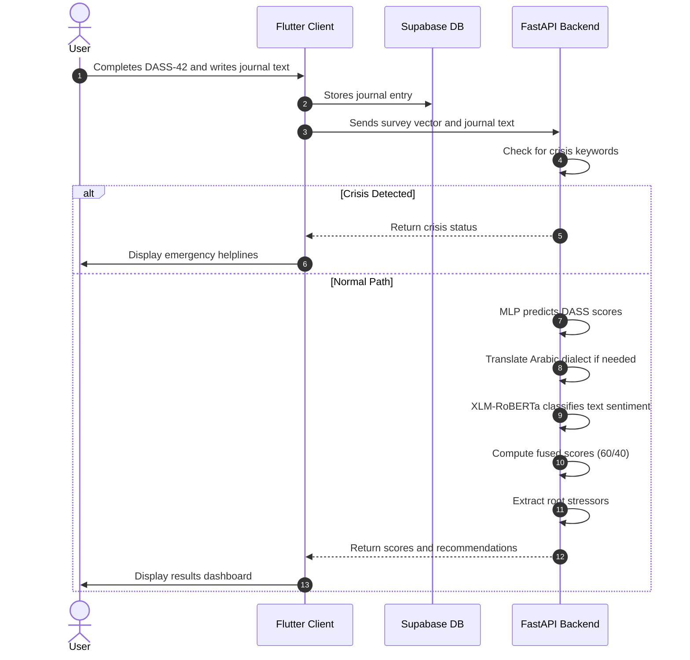

# SafeSpace: An AI-Powered Multi-Modal Mental Health Companion Using Clinical Assessments and Natural Language Processing

---

## Abstract

Mental health disorders represent one of the most pressing global health challenges of the twenty-first century. Depression, anxiety, and chronic stress affect hundreds of millions of individuals worldwide, yet access to timely and affordable mental health support remains limited. Traditional diagnostic pathways depend on face-to-face clinical consultations, which are constrained by high costs, long waiting lists, and social stigma. Digital self-help tools have attempted to fill this gap, but most existing applications offer only surface-level mood tracking or rule-based chatbot interactions that lack clinical depth.

This project presents SafeSpace, a cross-platform mobile application that combines two complementary assessment modalities to produce a more accurate picture of user well-being. The first modality is the Depression, Anxiety, and Stress Scale (DASS-42), a clinically validated 42-item psychometric questionnaire that produces quantitative severity scores. The second modality is a natural language processing (NLP) engine built on XLM-RoBERTa, a cross-lingual transformer model fine-tuned for mental health text classification. Users write free-text journal entries in English or colloquial Arabic, and the NLP engine extracts emotional indicators from the text. A weighted score-fusion algorithm combines both outputs, assigning 60 percent weight to the clinical survey and 40 percent to the text analysis, to generate a unified emotional profile that reduces the effect of self-report bias.

SafeSpace also includes a lexicon-based root-cause extractor that identifies the primary stressor behind a user's distress, such as academic pressure, workplace burnout, or interpersonal conflict. Based on these results, the application delivers personalized coping activities including guided breathing exercises, sensory grounding games, meditation sessions, and psychoeducational content. A real-time crisis detection module scans all text inputs for self-harm keywords in both English and Arabic and immediately overrides the standard scoring pipeline to display emergency helpline information. The system is built with a Flutter mobile frontend, a Python FastAPI backend deployed on Hugging Face Spaces, and a Supabase PostgreSQL database for secure data persistence.

---

## Acknowledgements

We would like to express our sincere gratitude to our project supervisor for the continuous guidance, constructive feedback, and academic mentorship provided throughout every phase of this project. Their expertise in machine learning and software engineering was instrumental in shaping both the technical architecture and the research methodology of SafeSpace.

We extend our appreciation to the faculty members and teaching assistants of the department for the foundational knowledge they provided across courses in artificial intelligence, software engineering, database systems, and mobile application development. These courses formed the technical backbone upon which this project was built.

We also acknowledge the mental health professionals who offered their perspectives on the clinical validity of the DASS-42 instrument and the appropriateness of the coping strategies integrated into the application. Their input ensured that the system remained grounded in established clinical practice.

Finally, we are deeply grateful to our families and friends for their patience, encouragement, and unwavering support throughout the demanding months of development, testing, and documentation. This project would not have been possible without their presence.

---

## Chapter 1: Introduction

### 1.1 Overview

Mental health conditions such as depression, anxiety, and chronic stress have become increasingly prevalent across all demographics, with particularly high incidence rates among university students and young professionals. The World Health Organization estimates that depression alone affects more than 280 million people globally. Despite this scale, the infrastructure for mental health support has not expanded at the same pace. In many regions, especially across the Middle East and North Africa (MENA), access to professional psychological services is limited by a shortage of trained practitioners, high consultation fees, and deeply rooted cultural stigmas surrounding mental illness.

The rise of mobile health (mHealth) applications has introduced new possibilities for self-directed mental health monitoring. Applications such as Calm, Headspace, and Wysa have gained significant user bases by offering meditation guides, mood logs, and conversational agents. However, these tools generally fall into one of two categories: either they focus exclusively on relaxation and mindfulness without incorporating clinical diagnostic instruments, or they employ rigid rule-based chatbots that cannot interpret the nuance and context of natural human language. Neither category provides a system that integrates validated clinical assessments with intelligent text analysis.

SafeSpace was developed to address this gap. It is a cross-platform mobile application that combines the DASS-42 clinical questionnaire with a transformer-based NLP engine capable of analyzing free-text journal entries written in English or colloquial Arabic. By fusing these two assessment modalities, SafeSpace produces a more complete and bias-resistant evaluation of the user's emotional state, and delivers personalized coping recommendations based on the identified root cause of distress.

### 1.2 Problem Definition

The project addresses four interconnected problems:

**Response Bias in Clinical Self-Reports.** The DASS-42 and similar psychometric instruments rely on users honestly rating the frequency and severity of their symptoms. However, research in clinical psychology has documented the phenomenon of "masking," where individuals consciously or unconsciously minimize their symptoms when completing structured questionnaires. This behavior is particularly common among users who fear judgment or who have internalized stigma around mental illness. As a result, survey-only assessments may produce false negatives, failing to identify users who are genuinely in distress.

**Absence of Contextual Root-Cause Analysis.** Standard psychometric instruments measure symptom intensity but do not capture the underlying causes of distress. A user who scores "Moderate" on the stress scale may be experiencing academic pressure, workplace conflict, or relationship difficulties, each of which calls for different coping strategies. Without identifying the root cause, digital tools can only offer generic advice that may not resonate with the user's specific situation.

**Language Barriers in Natural Language Processing.** The vast majority of NLP models for sentiment analysis and mental health classification are trained on English-language datasets. Users in the MENA region frequently express their emotions in colloquial Arabic dialects, including Egyptian, Levantine, and Gulf Arabic, which differ substantially from Modern Standard Arabic in vocabulary, grammar, and orthography. Existing digital mental health tools do not support these dialects, creating a significant accessibility barrier for Arabic-speaking populations.

**Lack of Proactive Crisis Detection.** Most mood tracking applications treat each data entry as an isolated event and do not perform real-time semantic analysis of user inputs. This means that a user who writes a journal entry containing indicators of suicidal ideation or self-harm may not receive any immediate response from the application. The absence of automated crisis detection represents a missed opportunity for early intervention.

### 1.3 Project Objectives

The project pursues the following technical and clinical objectives:

1. Develop a cross-platform mobile application using Flutter that provides a calming, accessible, and intuitive user experience with dark-mode styling and smooth animations.
2. Implement the full 42-question DASS-42 assessment as an interactive, paginated questionnaire within the mobile application.
3. Train and deploy a Multi-Layer Perceptron (MLP) classifier on a dataset of 39,775 clinical DASS-42 responses to predict severity categories for depression, anxiety, and stress.
4. Fine-tune and deploy an XLM-RoBERTa cross-lingual transformer model to classify the emotional content of free-text journal entries written in English or colloquial Arabic.
5. Design and implement a weighted score-fusion algorithm that combines the survey-based and text-based assessments into a unified emotional profile.
6. Build a lexicon-based root-cause extraction module that identifies primary stressors from journal text and maps them to targeted coping recommendations.
7. Implement a real-time crisis detection system that scans all text inputs for self-harm keywords in both English and Arabic and triggers immediate emergency resource display.
8. Deploy the AI inference backend as a containerized service on Hugging Face Spaces with optimized model caching for low-latency responses.

### 1.4 Project Scope

SafeSpace is designed as a self-assessment and coping companion. It is not intended to replace professional psychiatric diagnosis or treatment. The application targets young adults, university students, and working professionals aged 18 to 45 who experience mild-to-moderate emotional distress or chronic stress.

The system supports two languages for text input: English and colloquial Arabic (including Egyptian, Levantine, and Gulf dialects). The NLP pipeline translates dialectal Arabic inputs into standardized English before classification. The application does not prescribe pharmacological interventions; instead, it offers evidence-based coping activities drawn from cognitive behavioral therapy (CBT) and mindfulness traditions, including box breathing, sensory grounding, guided meditation, bubble pop and color match stress-relief mini-games, and morning and evening routine recommendations.

The mobile client is built for both Android and iOS platforms. The backend inference service is deployed on Hugging Face Spaces using Docker containerization.

### 1.5 Timeline

The project was executed across five phases over one academic year:

| Phase | Duration | Activities |
|:---|:---|:---|
| Research and Feasibility | Weeks 1–6 | Literature review of DASS-42, transformer architectures, Arabic NLP challenges. Technology stack selection. |
| Backend and Model Development | Weeks 7–14 | DASS-42 dataset preprocessing. MLP model training. XLM-RoBERTa fine-tuning. Database schema design in Supabase. |
| Frontend Development | Weeks 15–22 | Flutter UI implementation: onboarding, home dashboard, journal editor, DASS assessment, breathing exercises, mini-games. |
| System Integration | Weeks 23–28 | API endpoint development. Flutter-to-backend communication. Score fusion implementation. Crisis detection module. |
| Testing and Deployment | Weeks 29–36 | User acceptance testing. Performance optimization. Privacy configuration. APK compilation. Documentation. |

---

## Chapter 2: Literature Review

### 2.1 Introduction

This chapter examines the theoretical foundations and existing systems that inform the design of SafeSpace. It covers the clinical basis of the DASS-42 instrument, the evolution of transformer-based NLP architectures, the specific challenges of processing Arabic dialects, and a comparative analysis of existing digital mental health applications.

### 2.2 Background

#### 2.2.1 The DASS-42 Psychometric Instrument

The Depression, Anxiety, and Stress Scale (DASS-42) is a widely used self-report instrument developed by Lovibond and Lovibond (1995). It consists of 42 items divided equally across three subscales of 14 items each. Respondents rate each item on a four-point Likert scale from 0 ("Did not apply to me at all") to 3 ("Applied to me very much, or most of the time"), reflecting their experience over the past week.

The three subscales measure distinct but related constructs:

* **Depression subscale** (Items 3, 5, 10, 13, 16, 17, 21, 24, 26, 31, 34, 37, 38, 42): Assesses dysphoria, hopelessness, devaluation of life, self-deprecation, lack of interest, anhedonia, and inertia.
* **Anxiety subscale** (Items 2, 4, 7, 9, 15, 19, 20, 23, 25, 28, 30, 36, 40, 41): Assesses autonomic arousal, skeletal muscle effects, situational anxiety, and subjective anxious affect.
* **Stress subscale** (Items 1, 6, 8, 11, 12, 14, 18, 22, 27, 29, 32, 33, 35, 39): Assesses difficulty relaxing, nervous arousal, irritability, agitation, and impatience.

Clinical severity is determined by summing the scores within each subscale and comparing the total against established thresholds:

| Severity | Depression | Anxiety | Stress |
|:---|:---|:---|:---|
| Normal | 0–9 | 0–7 | 0–14 |
| Mild | 10–13 | 8–9 | 15–18 |
| Moderate | 14–20 | 10–14 | 19–25 |
| Severe | 21–27 | 15–19 | 26–33 |
| Extremely Severe | 28+ | 20+ | 34+ |

The DASS-42 has been validated across multiple cultures and languages, making it a suitable foundation for a cross-cultural digital assessment tool.

#### 2.2.2 Transformer Architectures for Text Classification

The Transformer architecture, introduced by Vaswani et al. (2017), fundamentally changed natural language processing by replacing recurrent computation with self-attention mechanisms. The core operation is scaled dot-product attention:

$$Attention(Q, K, V) = softmax\left(\frac{QK^T}{\sqrt{d_k}}\right)V$$

This mechanism allows every token in a sequence to attend to every other token simultaneously, capturing long-range dependencies that recurrent networks struggle with.

BERT (Bidirectional Encoder Representations from Transformers) applied the transformer encoder to produce contextualized word embeddings by training on masked language modeling and next-sentence prediction tasks. XLM-RoBERTa extended this approach to 100 languages by training on 2.5 terabytes of CommonCrawl data. It uses a shared SentencePiece vocabulary of 250,000 subword units, enabling cross-lingual transfer: knowledge learned from English text can improve classification performance on Arabic, even when Arabic training data is limited.

For mental health text classification, transformer models have demonstrated the ability to detect subtle linguistic markers of cognitive distortion, hopelessness, and emotional dysregulation that simpler bag-of-words or LSTM models often miss.

#### 2.2.3 Challenges of Arabic Dialect Processing

Arabic exhibits a phenomenon known as diglossia: Modern Standard Arabic (MSA) serves as the formal written standard, while numerous regional dialects are used in everyday speech and informal writing, including social media posts and personal journals. Egyptian Arabic, Levantine Arabic, Gulf Arabic, and Maghreb Arabic each have distinct vocabularies, grammatical structures, and even phonological systems.

These dialects lack standardized orthography. The same word may be spelled differently by different writers, and dialectal texts frequently incorporate loan words from English, French, or Turkish. This variability makes direct classification using MSA-trained models unreliable.

SafeSpace addresses this challenge by incorporating a translation preprocessing step that converts dialectal Arabic inputs into standardized English before passing them to the XLM-RoBERTa classifier. This approach leverages the extensive labeled English-language mental health datasets while preserving the semantic content of the original Arabic expression.

### 2.3 Relevant Works

Existing digital mental health applications can be grouped into three categories:

**Meditation and Mindfulness Applications.** Calm and Headspace are subscription-based applications that provide guided meditation sessions, sleep stories, and relaxation audio. While they offer high production quality and user engagement, they do not include any form of clinical assessment or diagnostic screening. They cannot evaluate the severity of a user's condition or tailor recommendations based on clinical indicators.

**Conversational Therapy Agents.** Wysa and Woebot use chatbot interfaces to deliver CBT-based interventions through structured conversation flows. Wysa employs a combination of rule-based logic and basic machine learning to guide conversations. Woebot uses scripted therapeutic modules. Both systems are limited to English and do not support Arabic dialects. Their conversational models cannot perform open-ended sentiment analysis of unstructured text.

**Telehealth Therapy Platforms.** BetterHelp and Talkspace connect users with licensed human therapists via text, audio, or video sessions. These platforms offer genuine clinical support but are expensive (typically $60–$100 per week), require scheduling, and are not designed for real-time self-assessment or automated screening.

### 2.4 Relationship Between Existing Work and Our Work

SafeSpace occupies a position that none of the existing systems fully addresses. Unlike Calm and Headspace, SafeSpace integrates a validated clinical instrument (DASS-42) to produce quantitative diagnostic indicators. Unlike Wysa and Woebot, SafeSpace uses a transformer-based NLP model capable of analyzing unstructured text in both English and Arabic dialects. Unlike BetterHelp, SafeSpace is automated, instant, and free to use at the point of access.

The key technical differentiator is the multi-modal score-fusion algorithm, which combines survey-based and text-based assessments to reduce response bias. No existing commercial application implements this approach.

### 2.5 Summary

The literature review reveals a clear gap in the digital mental health landscape: no existing system combines validated clinical psychometrics with bilingual transformer-based text analysis and automated root-cause extraction. SafeSpace is designed to fill this gap by integrating these capabilities into a single, accessible mobile application.

---

## Chapter 3: System Analysis

### 3.1 Development Methodology

SafeSpace was developed using an iterative Agile methodology organized into two-week sprints. Each sprint followed a cycle of planning, development, testing, and review. This approach allowed the team to deliver working increments regularly, incorporate feedback from supervisors and test users, and adapt to changing requirements as the project evolved.

Key milestones were tracked using a Kanban board, with tasks categorized as backlog, in progress, testing, or completed. Version control was managed through Git with a remote repository hosted on GitHub.

### 3.2 Requirements Analysis

System requirements were derived from three sources: analysis of user needs based on the target demographic, review of clinical best practices for mental health screening tools, and technical constraints imposed by the chosen deployment platforms.

### 3.3 Functional Requirements

**FR-1: User Authentication and Account Management.** The system must support user registration with email, username, and password. It must authenticate users via the Supabase authentication service and persist session tokens locally using SharedPreferences. Sensitive account information such as email addresses must not be displayed on the main profile screen; instead, such details must be accessible only through a dedicated settings sub-menu.

**FR-2: DASS-42 Clinical Assessment.** The application must present all 42 DASS-42 questions in a paginated, one-question-per-page format. Each question must offer four response options scored from 0 to 3. The system must calculate separate subscale scores for depression, anxiety, and stress using the standard item-to-subscale mappings and classify severity according to established clinical thresholds.

**FR-3: Free-Text Journaling with NLP Analysis.** The journal editor must provide separate input fields for the entry title and body content. Entries must be stored in the Supabase database with the format "Title\n\nBody". Users must be able to view, edit, and delete their journal entries. The system must support sending journal text to the backend NLP engine for emotional classification.

**FR-4: Multi-Modal Score Fusion.** The backend must accept both the 42-element survey answer vector and the journal text as inputs. It must compute separate scores using the MLP model (for survey data) and the XLM-RoBERTa model (for text data), then calculate a weighted fusion using 60 percent survey weight and 40 percent text weight.

**FR-5: Root-Cause Stressor Identification.** The backend must parse journal text against a bilingual keyword lexicon to identify the primary stressor category (academic, workplace, interpersonal, or general). The identified category must be used to select relevant coping recommendations.

**FR-6: Crisis Safety Net.** The backend must scan all incoming text for crisis keywords in English and Arabic. If a crisis keyword is detected, the system must bypass the scoring pipeline and return a crisis status that triggers an emergency overlay on the mobile client displaying helpline contact information.

**FR-7: Daily Mood Check-In.** The application must provide a daily check-in questionnaire that captures stress level, energy level, and sleep quality. Check-in data must be stored both locally and remotely and used to populate mood trend visualizations.

**FR-8: Therapeutic Coping Activities.** The application must offer interactive exercises including box breathing with animated visual guides, a 5-4-3-2-1 sensory grounding game, guided meditation, bubble pop and color match stress-relief mini-games, and morning and evening routine recommendations.

**FR-9: Psychoeducational Content.** The Explore tab must provide educational articles on anxiety, depression, and stress-versus-burnout, with full-text reading views. Daily wellness challenges such as hydration goals and gratitude journaling must also be available.

### 3.4 Non-Functional Requirements

**NFR-1: Performance.** API response times for the combined analysis endpoint must not exceed 3 seconds under standard mobile network conditions. Interactive animations must render at 60 frames per second on mid-range devices.

**NFR-2: Security and Privacy.** All network communication must use HTTPS. User passwords must be hashed. Journal entries must be accessible only by their author through database-level access controls. Email addresses must be hidden from the profile screen.

**NFR-3: Reliability.** The backend service must maintain high availability through Hugging Face Spaces container management. The mobile application must cache essential data locally to remain partially functional during network outages.

**NFR-4: Cross-Platform Compatibility.** The application must compile and run correctly on both Android and iOS devices with consistent layout and behavior.

### 3.5 System Workflow



---

## Chapter 4: System Design

### 4.1 UI/UX Design Philosophy

The visual identity of SafeSpace was designed to reflect the application's therapeutic purpose. The interface uses a dark color scheme built around deep indigo (`#0D0720`) and muted violet tones (`#1A1035`, `#221545`) to create a visually restful environment. Primary interactive elements use a rich purple (`#7B3FE4`) with lighter accent variants (`#9B6FFF`, `#B99EFF`) to draw attention without visual harshness. Feedback colors follow clinical conventions: green for normal states, yellow for mild concern, orange for moderate concern, and red for severe or critical states.

Typography uses the SF Pro Display font family for clean readability at all sizes. Cards and containers employ rounded corners (12–20 pixel radii) and subtle border highlights to establish visual hierarchy without sharp edges. Transitions between screens use smooth ease-in-out curves to reduce cognitive friction. The overall design principle is that a user who is already feeling anxious or overwhelmed should find the interface calming rather than stimulating.

### 4.2 Application Navigation Structure

The application uses a bottom navigation bar with four primary tabs:

1. **Home Tab:** The main dashboard displaying a daily motivational quote, action buttons for check-in, assessment, and NLP analysis, a daily plan section with links to Morning Ritual, Safe Journal, ADHD Exercise, and Nightly Unwind, and a personal goal tracker.
2. **Explore Tab:** Contains psychoeducational content cards on anxiety, depression, and stress-versus-burnout, each linking to a full-text article reader. Also includes daily wellness challenges such as hydration goals and gratitude journaling.
3. **Wellness Tab:** Provides access to therapeutic tools (box breathing, 5-4-3-2-1 grounding, meditation) and stress-relief mini-games (Bubble Pop, Color Match).
4. **Profile Tab:** Displays the user's name and avatar, with navigation links to Settings and Help Center, and a logout button. Sensitive account details such as email are intentionally excluded from this screen and accessible only through the Settings sub-menu.

### 4.3 Screen-by-Screen Design

#### 4.3.1 Splash and Onboarding Screens

The splash screen displays the SafeSpace logo while the application initializes Supabase and loads cached user data from SharedPreferences. If the user has not completed onboarding, they are routed to a three-page onboarding slider. Each page displays a custom illustration paired with a caption describing a core feature: emotional understanding, healthy habit building, and mood tracking. Users can swipe through pages or skip directly to registration.

#### 4.3.2 Registration and Authentication Screens

The sign-up screen collects username, email, and password. Input validation enforces non-empty fields and email format checks. Upon successful registration via the backend API, the user's credentials are cached locally and they are routed to the home screen. The sign-in screen provides returning users with email and password fields. Both screens use the application's dark card styling with purple accent buttons.

#### 4.3.3 Home Dashboard

The home screen greets the user by name and displays the current date. A motivational quote card is presented below the header. Three action buttons provide quick access to the daily mood check-in, the full DASS-42 assessment, and the standalone NLP text analysis screen. Below these buttons, a daily plan section lists four activity cards: Morning Ritual, Safe Journal, ADHD Exercise, and Nightly Unwind. Each card navigates to a dedicated screen. A goal tracker section at the bottom allows users to add, complete, and remove personal goals.

#### 4.3.4 Daily Check-In Screen

This screen captures three daily metrics through dedicated question cards. The first question measures stress level on a five-point scale using emoji-labeled options ranging from "Very stressed" to "Calm." The second question measures energy level using a continuous slider from 0 to 100 percent. The third question measures sleep duration using predefined hour ranges (less than 4 hours through 8 or more hours). Upon submission, the data is saved locally via SharedPreferences and synced to the Supabase database through the check-in API endpoint.

#### 4.3.5 DASS-42 Assessment Screen

The assessment begins with an introduction screen that explains the purpose and format of the DASS-42 instrument. When the user proceeds, the 42 questions are presented one per page using a PageView widget. Each question displays the item text and four response cards labeled "Did not apply to me at all" (0) through "Applied to me very much" (3). Selecting an option automatically advances to the next question after a 300-millisecond delay. After all 42 questions, a text input field allows the user to write a free-form description of their feelings. This text is sent alongside the survey vector to the backend analysis endpoint.

#### 4.3.6 DASS Results Screen

Upon receiving the backend response, this screen presents the assessment results. Three horizontal progress bars display the raw subscale scores for depression, anxiety, and stress, each color-coded by severity level. If the backend API returned successfully, additional information is displayed: the primary condition identified, the severity classification, the detected root cause of distress, tailored tips, resource links, and referral recommendations. A suicidal flag indicator is also checked; if active, a prominent crisis intervention notice is displayed.

#### 4.3.7 NLP Text Analysis Screen

This standalone screen allows users to submit free-text input for sentiment analysis without completing the full DASS-42 survey. It features a multi-line text input field with a hint indicating that both Arabic and English are supported. A microphone button activates the device's speech-to-text engine, allowing users to dictate their thoughts vocally. Upon submission, the text is sent to the backend analysis endpoint with zeroed survey answers. The returned text scores are displayed as three labeled progress bars showing depression, anxiety, and stress probabilities. An informational note explains that these are raw model probabilities.

#### 4.3.8 Journal Editor Screen

The journal screen provides a structured writing interface with separate text fields for the entry title and body content. A save button formats the input as "Title\n\nBody" and stores it in the Supabase database via the journal API endpoint. Below the editor, a scrollable list displays previous journal entries with the entry date, title, and a body preview that excludes the title to avoid duplication. Each entry card provides edit and delete actions. The edit dialog separates the title and body back into individual fields for convenient modification.

#### 4.3.9 Wellness Tools and Mini-Games

The box breathing screen uses a pulsating animated circle that expands and contracts on a timed cycle (inhale 4 seconds, hold 4 seconds, exhale 4 seconds, hold 4 seconds), with on-screen text instructions that update with each phase. The grounding screen implements the 5-4-3-2-1 technique as a gamified selection interface: users choose from suggested sensory items (e.g., "Phone," "Desk," "Window" for the "See" step) with chip-based selection controls. The meditation screen provides a guided session with a timer and ambient instructions. Bubble Pop presents tappable floating circles that burst on contact, and Color Match challenges users to quickly identify matching colors, both designed as brief cognitive distraction exercises.

#### 4.3.10 Morning Ritual and Nightly Unwind Screens

These recommendation screens dynamically generate activity suggestions based on the user's most recent DASS-42 results. If the user has elevated stress scores, morning recommendations include calm breathing and morning journaling. If anxiety scores are elevated, suggestions include daily intention setting and mindful beverage consumption. If depression scores are elevated, physical movement and music-based mood lifting are suggested. Evening recommendations similarly adapt, suggesting digital detox, progressive muscle relaxation, grounding exercises, positive reflection, and self-compassion affirmations. If no DASS results are available, a set of general wellness recommendations is displayed.

#### 4.3.11 Mood Patterns and Trend Visualization Screen

The mood patterns screen provides longitudinal visual analytics of the user's emotional trajectory. It fetches both local check-in history from SharedPreferences and remote check-in records from the backend API, merging them into a unified dataset. Three interactive line charts, rendered using the `fl_chart` package, display stress level, energy level, and sleep quality over configurable time windows of 7, 14, or 30 days. Each chart uses color-coded data points and smooth Bézier curves to highlight trends. A separate section fetches the user's DASS-42 analysis history from the `/analyses/history` endpoint and displays historical depression, anxiety, and stress scores as overlaid trend lines, enabling users to observe how their clinical indicators evolve across multiple assessments.

#### 4.3.12 Settings Screen

The settings screen is organized into three sections: Account Information (displaying username and email), Security (providing a password reset option that sends a reset link via Supabase), and Preferences (notification settings and language selection). This screen is the only location where the user's email address is visible, fulfilling the privacy requirement that sensitive credentials not appear on the main profile view.

### 4.4 Database Schema Design

The PostgreSQL database managed through the FastAPI backend contains five primary tables:

```
[users]                            [journal_entries]
 id (INT, PK, auto-increment)       id (INT, PK, auto-increment)
 name (VARCHAR, nullable)            user_id (INT, FK -> users.id)
 email (VARCHAR, Unique, Indexed)    content (TEXT)
 password (VARCHAR, hashed)          created_at (TIMESTAMP)
 created_at (TIMESTAMP)              updated_at (TIMESTAMP, nullable)

[checkins]                         [analyses]
 id (INT, PK, auto-increment)       id (INT, PK, auto-increment)
 user_id (INT, FK, Indexed)          user_id (INT, FK, Indexed)
 mood (INT)                          primary_condition (VARCHAR)
 sleep (INT)                         clinical_scoring (JSON)
 energy (FLOAT)                      text_input (TEXT)
 created_at (TIMESTAMP)              text_input_hash (TEXT)
                                     text_scores (JSON)
                                     survey_scores (JSON)
                                     fused_scores (JSON)
                                     severity (TEXT)
                                     cause (TEXT)
                                     suicidal_flag (BOOLEAN)
                                     model_version (TEXT)
                                     app_version (TEXT)
                                     locale (TEXT)
                                     created_at (TIMESTAMP)
```

The `analyses` table is the richest entity in the schema. It stores the complete audit trail of every assessment: the raw text input (with a SHA-256 hash for deduplication), the individual model outputs (`text_scores` and `survey_scores` as JSON), the fused result, the detected severity level, root cause category, and suicidal flag. The `clinical_scoring` column stores the DASS-42 subscale breakdown as a JSON object with nested `score` and `severity` fields for each of depression, anxiety, and stress. Composite indexes on `(user_id, created_at)` are defined on both the `analyses` and `checkins` tables to optimize time-series queries for the mood patterns screen.

The `journal_entries.content` field stores the combined title and body text in the format "Title\n\nBody". This concatenated format was chosen to maintain backward compatibility with the backend analysis endpoint, which expects a single text string. The mobile client parses this format on retrieval, extracting the first line as the title and the remaining lines as the body content. The `updated_at` column is populated whenever a journal entry is modified through the PUT endpoint.

Goals are stored locally in SharedPreferences on the device and are scoped to the current `user_id` via dynamically constructed cache keys (e.g., `goals_$userId`), ensuring that switching accounts does not expose another user's data.

### 4.5 System Architecture

```
┌─────────────────────────────────────────────────┐
│              Flutter Mobile Client              │
│  ┌──────────┐ ┌──────────┐ ┌──────────────────┐ │
│  │Onboarding│ │   Home   │ │  DASS Assessment │ │
│  │  Screen  │ │Dashboard │ │     Screen       │ │
│  └──────────┘ └──────────┘ └──────────────────┘ │
│  ┌──────────┐ ┌──────────┐ ┌──────────────────┐ │
│  │ Journal  │ │ Wellness │ │   NLP Analysis   │ │
│  │  Editor  │ │  Tools   │ │     Screen       │ │
│  └──────────┘ └──────────┘ └──────────────────┘ │
│              SharedPreferences Cache             │
└───────────────┬──────────────┬──────────────────┘
                │ HTTPS/JSON   │ Supabase SDK
                ▼              ▼
┌───────────────────┐  ┌──────────────────────────┐
│  FastAPI Backend   │  │   Supabase Cloud         │
│  (Hugging Face)    │  │  ┌────────────────────┐  │
│ ┌───────────────┐  │  │  │ PostgreSQL Database │  │
│ │ MLP Predictor │  │  │  │  - users           │  │
│ │ (NumPy)       │  │  │  │  - journal_entries  │  │
│ ├───────────────┤  │  │  │  - mood_records     │  │
│ │ XLM-RoBERTa   │  │  │  │  - goals           │  │
│ │ (PyTorch)     │  │  │  └────────────────────┘  │
│ ├───────────────┤  │  │  ┌────────────────────┐  │
│ │ Score Fusion  │  │  │  │ Auth Service       │  │
│ │ + Crisis Net  │  │  │  │  - Sessions        │  │
│ └───────────────┘  │  │  │  - Password Reset  │  │
└───────────────────┘  │  └────────────────────┘  │
                       └──────────────────────────┘
```

---

## Chapter 5: Technical Implementation

### 5.1 Mobile Frontend Module

**Purpose.** The mobile frontend serves as the primary interface through which users interact with the SafeSpace system. It handles all user input collection, local data caching, screen navigation, and presentation of results.

**Technologies Used.** The frontend is built with Flutter 3.x using the Dart programming language. Flutter was selected because it compiles to native ARM code for both Android and iOS from a single codebase, eliminating the need to maintain separate platform-specific implementations. Additional packages include `supabase_flutter` for database and authentication integration, `http` for REST API communication, `shared_preferences` for local key-value caching, `fl_chart` for rendering assessment result charts, `speech_to_text` for voice input on the NLP analysis screen, and `intl` for date formatting.

**Architecture.** The application follows a centralized state management pattern. A static `AppState` class in `lib/data/app_state.dart` serves as the single source of truth for user identity, mood history, journal entries, goal lists, and DASS results. This class provides methods for loading data from SharedPreferences on startup, saving updated state after user actions, and syncing with the remote database through `ApiService`. Screens read from and write to `AppState` directly, ensuring consistency across the application.

**Key Implementation Details.** The DASS-42 questions are defined as a constant list of `DassQuestion` objects in `lib/data/dass_questions.dart`, each containing an ID string and the question text. The assessment screen uses a `PageController` to manage the paginated question flow, a map of integer answers indexed by question number, and hardcoded arrays of item indices for each subscale (depression, anxiety, stress) to compute scores on submission.

The journal screen concatenates title and body inputs as `"$title\n\n$body"` before calling `AppState.addJournalEntry()`. When displaying entries, `AppState.refreshJournalEntries()` parses the stored content by splitting on newlines: the first line becomes the title, and lines after the second become the body preview, preventing the title from appearing twice in the display.

**Security Considerations.** Session tokens managed by the Supabase SDK are stored in the device's secure storage. The profile screen intentionally omits the user's email address; this information is accessible only through the settings screen, reducing exposure of sensitive data during casual use.

### 5.2 Backend API Module

**Purpose.** The backend hosts the machine learning models and exposes REST API endpoints for authentication, analysis, check-in recording, and journal management.

**Technologies Used.** The backend is written in Python 3.9+ using FastAPI as the web framework, with Uvicorn as the ASGI server. Machine learning inference uses PyTorch for the XLM-RoBERTa transformer and NumPy for the MLP forward pass. The entire backend is containerized using Docker and deployed on Hugging Face Spaces, which provides free-tier hosting with automatic container management.

**API Endpoints.** The `ApiService` class on the Flutter client communicates with the following endpoints hosted at `https://alisakr9997-safespace.hf.space/api/v1`:

| Endpoint | Method | Purpose |
|:---|:---|:---|
| `/auth/signup` | POST | Register a new user with name, email, and password |
| `/auth/login` | POST | Authenticate and return user credentials |
| `/analyze` | POST | Accept survey answers and text, return fused scores |
| `/chat` | POST | Forward messages to a chatbot proxy |
| `/checkin` | POST | Record a daily mood check-in |
| `/checkin/history` | GET | Retrieve check-in history for a user |
| `/journal` | POST | Create a new journal entry |
| `/journal/history` | GET | Retrieve journal entries for a user |
| `/journal/{id}` | PUT | Update an existing journal entry |
| `/journal/{id}` | DELETE | Delete a journal entry |
| `/analyses/history` | GET | Retrieve past analysis results |

**Performance Considerations.** The XLM-RoBERTa model is loaded into memory once at server startup and cached using Python's `@lru_cache` decorator and Streamlit's `@st.cache_resource` annotation. This eliminates repeated disk reads and model initialization, reducing inference latency from over 8 seconds on cold start to under 1.5 seconds for cached requests.

### 5.3 AI Model Implementations

#### 5.3.1 DASS-42 Multi-Layer Perceptron

The MLP model was trained on 39,775 labeled DASS-42 survey responses. The architecture consists of an input layer of 42 nodes (one per question), a hidden layer of 64 nodes with ReLU activation, and an output layer of 3 nodes representing depression, anxiety, and stress probabilities with softmax activation.

**Answer Scale Shifting.** An important preprocessing step occurs before the survey vector reaches the MLP. The Flutter client collects answers on a 0–3 Likert scale (matching the standard DASS-42 format), but the MLP was trained on a dataset that uses a 1–4 scale. The backend therefore shifts every answer by adding 1 before inference:

```python
shifted_answers = [a + 1 for a in request.survey_answers]
```

This single-line transformation is critical: omitting it would cause the model to systematically underestimate severity, since all input values would be one unit lower than the training distribution.

**Feature Scaling.** After shifting, the answer vector is normalized using a pre-fitted StandardScaler (`scaler.pkl`) that was saved during training. This scaler transforms the 42-dimensional input to have zero mean and unit variance, matching the distribution the model weights expect.

**Lightweight Inference.** To minimize deployment dependencies, the trained weights and biases were exported to a serialized pickle file (`model_weights.pkl`). At inference time, the backend loads these parameters and performs raw matrix multiplication using NumPy:

```python
import pickle
import numpy as np

with open("model_weights.pkl", "rb") as f:
    params = pickle.load(f)

def predict_dass(survey_vector: list) -> list:
    x = np.array(survey_vector, dtype=np.float32).reshape(1, -1)
    
    # Hidden layer with ReLU
    h = np.dot(x, params['weights'][0]) + params['biases'][0]
    h = np.maximum(0, h)
    
    # Output layer with softmax
    logits = np.dot(h, params['weights'][1]) + params['biases'][1]
    exp_logits = np.exp(logits - np.max(logits))
    probs = exp_logits / np.sum(exp_logits)
    
    return probs.flatten().tolist()
```

This approach avoids importing PyTorch or TensorFlow for the survey model, keeping the inference footprint minimal.

#### 5.3.2 XLM-RoBERTa Text Classifier

The text classification pipeline processes journal entries through five stages:

1. **Text Cleaning:** The input text is normalized by collapsing repeated characters (e.g., "soooo" → "soo"), removing punctuation and special characters while preserving Arabic Unicode characters (`\u0600`–`\u06FF`), and collapsing whitespace.
2. **Dialect Translation:** The cleaned text is translated to English using GoogleTranslator (via the `deep-translator` library). The translated English text and the original text are concatenated with a `[SEP]` separator token to form a bilingual input: `"english_translation [SEP] original_text"`. This dual-input strategy ensures the model receives both the semantically standardized English version and the original dialectal nuances.
3. **Tokenization:** The combined text is tokenized using the XLM-RoBERTa tokenizer with padding, truncation at 192 tokens, and conversion to PyTorch tensors.
4. **Classification:** The tokenized input is passed through the fine-tuned XLM-RoBERTa model in inference mode (`torch.no_grad()`). The output logits are converted to probabilities via softmax, yielding raw scores for depression, anxiety, and stress.
5. **Keyword Boost Post-Processing:** The raw model probabilities are passed through a keyword boost function that corrects for an observed stress-bias in the XLM-RoBERTa output.

**Keyword Boost System.** During testing, it was observed that the fine-tuned XLM-RoBERTa model exhibited a systematic bias toward predicting "stress" even when the input text contained explicit depression or anxiety indicators. To compensate, a post-processing `keyword_boost()` function scans the original text and its English translation against three bilingual keyword lexicons:

- **Depression keywords** (56 terms): Including Arabic dialect variants such as "مكتئب" (depressed), "مفيش أمل" (no hope), "نفسيتي وحشة" (my mood is terrible), and English terms such as "hopeless," "worthless," and "numb."
- **Anxiety keywords** (27 terms): Including "قلقان" (anxious), "هلع" (panic), "وسواس" (OCD), and English terms such as "panic," "restless," and "phobia."
- **Stress keywords** (13 terms): Including "مضغوط" (pressured), "إجهاد" (exhaustion), and English terms such as "burnout" and "overwhelmed."

The function counts keyword hits for each category. If the dominant keyword category differs from the model's top prediction, the function overrides the probability distribution by boosting the keyword-matched condition to a minimum of 55% (increasing by 10% per additional keyword hit, capped at 85%) and proportionally redistributing the remaining probability among the other two conditions. The final scores are normalized to sum to 1.0. This mechanism ensures that when a user explicitly writes "I feel depressed and hopeless," the system does not incorrectly classify it as stress.

#### 5.3.3 Score Fusion and Crisis Override

The fusion algorithm combines both model outputs using the formula:

$$S_{fused} = 0.60 \times S_{survey} + 0.40 \times S_{text}$$

**Suicidal Ideation Detection.** Before any scoring is computed, the `detect_suicidal()` function scans all incoming text against a lexicon of 28 bilingual crisis phrases. These include direct expressions such as "انتحار" (suicide), "أقتل نفسي" (kill myself), "عايز أموت" (I want to die), "مش عايز أعيش" (I don't want to live), "إيذاء النفس" (self-harm), and "لو مت" (if I die), as well as English equivalents including "end my life," "hurt myself," "want to disappear," and "can't go on." If any crisis keyword matches, the entire scoring pipeline is bypassed. The API returns a crisis response with:

- `suicidal_flag: true`
- `severity: "crisis"`
- Emergency tips in both English and Arabic (e.g., "You are not alone — help is available right now" / "أنت لست وحدك — المساعدة متاحة الآن")
- International crisis hotline resources including the International Association for Suicide Prevention, Crisis Text Line (US: text HOME to 741741), Befrienders Worldwide, Egypt's Image helpline (08008880700), and Saudi Arabia's Musanadah line (920033360)
- An urgent referral message directing the user to contact a crisis line or visit the nearest emergency room

On the mobile client, this crisis response triggers a prominent modal overlay that supersedes the normal results display.

**Root-Cause Stressor Extraction.** If no crisis is detected, the fused scores are computed and the `extract_cause()` function parses the text against a bilingual keyword lexicon organized into nine cause categories:

| Category | Example Keywords (EN) | Example Keywords (AR) |
|:---|:---|:---|
| Work | boss, deadline, salary, overtime | شغل, مدير, راتب, وظيفة |
| Relationships | breakup, divorce, lonely, conflict | حبيب, طلاق, وحيد, خلاف |
| Financial | debt, broke, rent, unemployment | فلوس, دين, إيجار, بطالة |
| Academic | exam, grades, university, study | امتحان, درجات, جامعة, مذاكرة |
| Health | pain, hospital, medication, sleep | وجع, مستشفى, دواء, نوم |
| Social | judgment, shy, isolated, can't talk | حكم, خجل, منعزل |
| Self-Worth | failure, worthless, not enough, loser | فاشل, لا قيمة, مش كافي |
| Trauma | abuse, nightmares, death, accident | صدمة, إساءة, كوابيس, وفاة |
| General | (fallback when no keywords match) | (fallback) |

The function counts keyword hits per category and selects the category with the highest count. If no keywords match, the cause defaults to "general." The detected cause is passed to the recommendation engine to select domain-specific coping advice.

### 5.4 Database and Authentication Module

**Purpose.** Supabase provides the authentication service for the Flutter client, while the FastAPI backend manages its own PostgreSQL connection for data persistence through SQLAlchemy ORM.

**Technologies Used.** The Flutter client connects to Supabase via the `supabase_flutter` SDK for authentication (signup, login, password reset, session management). The FastAPI backend connects directly to the PostgreSQL database using SQLAlchemy with connection pooling (`pool_pre_ping=True`) and a 5-second connection timeout. Database tables are created automatically at server startup via `Base.metadata.create_all()` wrapped in an 8-second async timeout to prevent blocking the server if the database is temporarily unreachable.

**Security Considerations.** User passwords are hashed using SHA-256 before storage. The login endpoint supports both hashed password comparison and a legacy plain-text fallback for users who registered before hashing was implemented. Password reset for the mobile client is implemented through Supabase's `resetPasswordForEmail` method. All API communication uses HTTPS, and CORS middleware is configured to accept requests from any origin to support the cross-platform Flutter client.

**Integration.** The `ApiService` class on the Flutter client appends the current `AppState.userId` to all API requests, ensuring that backend operations are scoped to the authenticated user. Journal entries, check-in records, and analysis histories are all filtered by `user_id` in both API queries and database access patterns.

### 5.5 Bilingual Recommendation Engine

**Purpose.** The recommendation engine translates raw assessment outputs into actionable, personalized coping advice. It is the module that bridges the gap between clinical scoring and practical user guidance.

**Architecture.** The engine is implemented in `recommendations.py` (564 lines) and is structured as a hierarchical decision tree with three levels:

1. **Severity Classification:** The `get_severity()` function converts the fused model probability (0.0–1.0) into a DASS-42 raw score approximation by multiplying against the maximum possible raw score for each subscale (depression: 84, anxiety: 72, stress: 84). The approximated score is then classified against the standard DASS-42 clinical cutoffs into one of five levels: normal, mild, moderate, severe, or extremely severe. For recommendation selection, these five levels are grouped into two severity bands: `mild_moderate` (normal through moderate) and `severe` (severe and extremely severe).

2. **Root-Cause Routing:** The detected cause category (from the stressor extraction module) is used to select a cause-specific recommendation set within the identified condition. For example, a user classified as "depression + work" receives different advice than a user classified as "depression + self_worth." If the detected cause does not have a dedicated recommendation set, the engine falls back to the "general" recommendations for that condition.

3. **Bilingual Content Delivery:** Every recommendation entry contains four parallel content arrays: `tips_en` (practical coping tips in English), `tips_ar` (the same tips in Arabic), `resources_en` (books, apps, and therapeutic techniques in English), `resources_ar` (the same resources in Arabic), plus bilingual referral messages indicating when to seek professional help.

**Recommendation Database Coverage:**

| Condition | Cause Categories Covered |
|:---|:---|
| Anxiety | Work, Relationships, General |
| Depression | Work, Self-Worth, General |
| Stress | Work, Academic, General |

Each condition-cause combination provides separate recommendation sets for `mild_moderate` and `severe` severity bands, totaling 18 distinct recommendation profiles.

**Crisis Override.** When the suicidal ideation detector triggers, the entire recommendation lookup is bypassed. A hardcoded `SUICIDAL_REC` object is returned containing:
- Four bilingual safety tips (e.g., "Remove access to any means of self-harm if possible")
- International crisis resources including the IASP Crisis Centres directory, Crisis Text Line, Befrienders Worldwide, Egypt's Image helpline, and Saudi Arabia's Musanadah line
- An urgent bilingual referral directing the user to contact a crisis line or visit the nearest emergency room immediately

### 5.6 Cross-Platform Flutter Web Deployment

**Purpose.** To ensure maximum accessibility and support users who prefer browser-based access without installing a mobile application, the Flutter mobile client was compiled for the web and deployed to production. This web deployment provides a desktop-friendly and browser-accessible version of the entire SafeSpace application, offering supervisors and examiners a zero-installation environment to interact with the project.

**Technologies Used.** The web build compiles the Dart codebase into optimized HTML, CSS, and JavaScript. It utilizes Flutter's multi-engine rendering pipeline, utilizing the HTML renderer for faster initial page loads and compatibility on mobile web browsers, alongside CanvasKit (WebGL-based rendering) for desktop browsers to ensure high-performance UI rendering and smooth 60 FPS animations. The application is hosted on Netlify, a developer-centric cloud platform specializing in globally distributed static hosting with integrated continuous deployment.

**Deployment Architecture.**
*   **Compilation:** The app was built using the `flutter build web --release` compilation command, generating static assets in the `/build/web` directory (including `index.html`, compiled JS main entry points, manifest files, and cached assets).
*   **Hosting:** The static assets are hosted on Netlify's content delivery network (CDN) edge nodes.
*   **API Connection:** The web client communicates over HTTPS directly with the FastAPI backend hosted on Hugging Face Spaces (`https://alisakr9997-safespace.hf.space/api/v1`), maintaining a clean frontend-backend separation.
*   **Routing and Redirections:** A custom `_redirects` configuration file was added to Netlify's deployment directory to handle single-page application (SPA) routing fallbacks, routing all direct sub-page URLs back to `index.html` to allow the Flutter router to manage the internal navigation stack.

**UI/UX and Functional Consistency.** Since the web build compiles from the same codebase as the mobile application, the user experience is completely identical. The web version supports the exact same authentication flow via Supabase, daily check-ins, journal logging, goals management, and DASS-42 assessments. The responsive layout adapts the mobile navigation bar into a spacious dashboard suited for desktop and tablet screens.

---

## Chapter 6: Conclusion and Future Work

### 6.1 Conclusion

This project successfully designed, implemented, and deployed SafeSpace, a cross-platform mobile application that addresses fundamental limitations in existing digital mental health tools. The system combines the clinical rigor of the DASS-42 psychometric instrument with the contextual sensitivity of transformer-based natural language processing, producing a multi-modal assessment that is more resistant to self-report bias than either modality alone.

The key contributions of this project are:

**Multi-Modal Score Fusion.** The weighted fusion algorithm (60 percent survey, 40 percent text) reduces the impact of response masking by incorporating semantic analysis of the user's own words. A user who minimizes symptoms on the DASS-42 but writes a journal entry expressing significant distress will receive a fused score that reflects the true severity more accurately than the survey score alone.

**Bilingual Dialect Support.** The translation preprocessing pipeline enables the NLP engine to process colloquial Arabic dialects, including Egyptian, Levantine, and Gulf Arabic, which are the primary modes of emotional expression for millions of users in the MENA region. This capability is absent from all major commercial mental health applications reviewed in this project.

**Automated Root-Cause Extraction.** By parsing journal text against a bilingual keyword lexicon, the system identifies the primary domain of distress and delivers coping recommendations specific to that domain. A student experiencing academic stress receives different suggestions than a professional experiencing workplace burnout.

**Real-Time Crisis Safety Net.** The automated keyword scanner provides an immediate safety override when self-harm indicators are detected, connecting users with emergency resources without requiring them to explicitly request help. This proactive approach addresses a critical gap in existing mood tracking applications.

**Comprehensive Therapeutic Toolkit.** Beyond assessment, the application provides a rich set of evidence-based coping activities including guided breathing, sensory grounding, meditation, psychoeducational content, daily wellness challenges, and cognitive distraction games, all accessible within a single, cohesive interface.

### 6.2 Future Work

Several directions for future development would extend the capabilities and clinical validity of SafeSpace:

**Biometric Data Integration.** Connecting the application to wearable device APIs such as Apple HealthKit and Google Fit would enable the system to incorporate physiological indicators including heart rate variability, sleep duration, and physical activity levels. These objective biometric signals could serve as a third assessment modality, further reducing reliance on self-report data.

**Voice Emotion Recognition.** The existing speech-to-text functionality could be extended with audio feature analysis to detect emotional indicators in the user's vocal characteristics, such as pitch variation, speech rate, and pause patterns. This would provide an additional layer of sentiment analysis beyond the transcribed text content.

**Clinical Validation Study.** A controlled pilot study comparing the system's automated fused assessments against evaluations by licensed mental health professionals would provide empirical evidence of diagnostic accuracy. Such validation would strengthen the clinical credibility of the multi-modal fusion approach and identify areas for threshold calibration.

**Expanded Language Support.** The current translation pipeline could be extended to support additional languages and dialects, including French-Arabic code-switching common in North African countries, Urdu, and Turkish, broadening the application's accessibility across diverse populations.

**Longitudinal Trend Analysis.** Implementing time-series analysis of historical check-in and assessment data would enable the system to detect deteriorating trends over weeks or months, providing early warnings before a user reaches a critical state.
